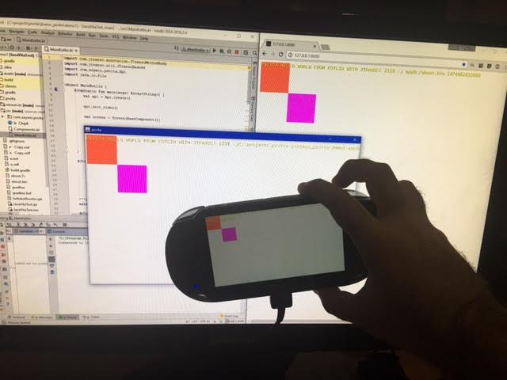

## psvita-java

This is a mixed Java+Kotlin demo that can run in the JVM, the browser and PSVita,
and could be easily ported to other platforms like 3DS among others.

In PSVita/C++ it uses ARC instead of GC, so the performance is constant and doesn't
have any delays. It works thanks to [JTransc](https://github.com/jtransc/jtransc) +
the great new C++ target in 0.4.0 done by [dsp-omen](https://github.com/dsp-omen).
For drawing without dependencies on psvita, it uses xerpi's [draw.c](https://github.com/xerpi/libftpvita/blob/master/sample/draw.c) from a sample in libftpvita, but you can hook any C library/code easily in order to for example run libvita2d or raw gxm calls.

You can develop your application directly in intelliJ and test it using your favourite debugger, and then when ready compile it for the psvita and install it in just one click (`installFtp` gradle task).

## Run in the PSVita

Go to `demo1` directory, and with the vitasdk installed and `VITASDK` environment variable properly set, execute `gradlew buildVita`.
That will generate a vpk file that can be uploaded to a psvita with henkaku.

You can also execute: `installFtp` that will upload via ftp to the ip in env `VITAFTP`, and will promote it with VitaShell >= 0.95.

## Run in the Browser

Go to `demo1` directory and run `gradlew distJs`. It will generate `build/jtransc-js/index.html` that you can serve along the `program.js` file with any webserver.

## Run in the JVM

Go to `demo1` directory and open `build.gradle` with intelliJ (Community Edition is ok).
